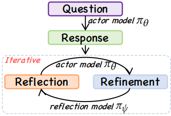

### We sincerely thank all reviewers for their valuable feedback and encouraging comments.

### For rebuttal, please refer recsys_rebuttal_final.pdf
### For Reviewer1, a brief proof can refer proof.pdf
### For Reviewer2, a example can refer example.pdf


Code for $R^{4}$ec: a \underline{R}easoning,\underline{R}eflection, and \underline{R}efinement framework for \underline{R}ecommendation Systems

### step 1: preprocess dataset
you can first download Amazon-Books dataset and run `python preprocess/preprocess_amz.py` to preprocess Amazon-Books for CTR task.

### step 2: preprocess thinking, reflection, refinement dataset
you can find all prompt template in `prompt/prompt.py`

### step 3: fine-tune actor model and reflection model
we use amz user as a example.
#### step 3.1 download llama_factory
```bash
git clone --depth 1 https://github.com/hiyouga/LLaMA-Factory.git
cd LLaMA-Factory
pip install -e ".[torch,metrics]"
```
#### step 3.2 fine-tune amz user actor model and reflection model
```bash
CUDA_VISIBLE_DEVICES=0 llamafactory-cli train examples/train_lora/qwen2.5_7b_amz_user_thinking.yaml
CUDA_VISIBLE_DEVICES=1 llamafactory-cli train examples/train_lora/qwen2.5_7b_amz_user_reflection.yaml
```
you can find qwen2.5_7b_amz_user_thinking.yaml and qwen2.5_7b_amz_user_reflection.yaml in `utils`
then we can get actor model and reflection model

#### step 3.3 infer user preference knowledge
```bash
CUDA_VISIBLE_DEVICES=0 llamafactory-cli train examples/train_lora/amz_user_thinking_infer.yaml
```
then we can get the first knowledge inferred by actor model 

#### step 3.4 judge whether the user preference knowledge is reasonable
```bash
CUDA_VISIBLE_DEVICES=0 llamafactory-cli train examples/train_lora/amz_user_reflect_infer.yaml
```
then we can judge whether the user preference is reasonable, we need to filter out the knowledge is deemed unreasonable

#### step 3.5 refine the final user preference knowledge
```bash
CUDA_VISIBLE_DEVICES=0 llamafactory-cli train examples/train_lora/amz_user_refine_infer.yaml
```
then you can get the final refined preference.
amz_user_thinking_infer.yaml, amz_user_reflect_infer.yaml, and amz_user_refine_infer.yaml can be found in `utils`
the amz item factual knowledge can be obtained in the same way.

#### step 4 knowledge embedding
you can run `python rec/knowledge_bge.py` to get the knowledge embedding.

#### step 5 run ctr task
```bash
python rec/run_ctr_amz_autoint.py 
```
you can replace the model in `rec/run_ctr_amz_autoint.py` to get different backbone models.
we support autoint, dcn ,deepfm, dien, din, gru4rec, fignn, xdeepfm.
